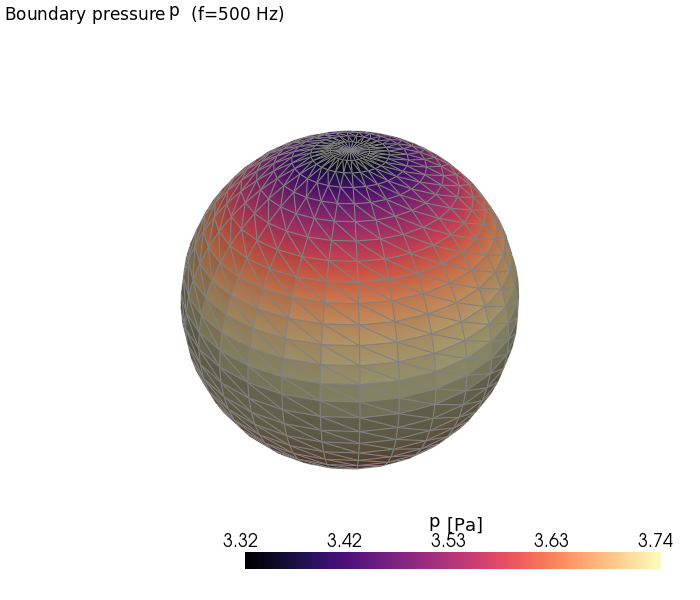
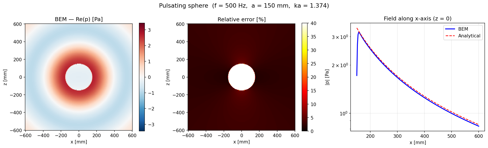

# Acoustic radiation (external BEM)

This tutorial shows how to compute the sound field radiated by a vibrating
surface using `sd.model.AcousticExternalProblem`, a collocation **boundary
element method (BEM)** solver for the exterior Helmholtz problem.

Unlike the FEM elements in the other tutorials (which discretise a volume), the
BEM discretises only the **surface** of the radiating body. The body is given as
a triangular surface mesh — for example a `pyvista.PolyData` — with coordinates
in **metres**. Prescribe a boundary condition on that surface and the solver
returns the acoustic field anywhere in the surrounding medium.

We use a **pulsating sphere** (a sphere whose surface moves uniformly in the
radial direction) as the worked example, because it radiates a simple
monopole-like field with a known analytical solution to validate against.

## Theoretical background

**Sound** is a small fluctuation of pressure travelling through a fluid (air or
water). At rest the fluid sits at a uniform ambient pressure and density; when a
surface vibrates it pushes on the adjacent fluid, and that disturbance propagates
outward as a wave at the speed of sound $c$. The *acoustic* pressure
$\tilde p(\mathbf{x}, t)$ (in position $\mathbf{x}$, at time $t$) is exactly this tiny deviation from the ambient pressure — typically a handful of pascals or less, against an atmospheric background of $\sim 10^5$ Pa — which is why the governing equations can be
*linearised* about the rest state. When dealing with acoustic problems a new variable is introduced - called velocity potential $\Psi(\mathbf{x},t)$. It is a scalar variable, related to medium particle velocity by

$$
\mathbf{V}(\mathbf{x}, t)=\nabla\Psi(\mathbf{p},t)
$$

For a homogeneous, inviscid fluid the velocity potential obeys the
**wave equation**

$$
\nabla^2 \Psi(\mathbf{x}, t) = \frac{1}{c^2}\,
\frac{\partial^2}{\partial t^2}\Psi(\mathbf{x}, t)
$$

where $c$ is the speed of sound ($\approx 343$ m/s in air). If we consider only periodic solutions to the wave equation, the velocity potential $\Psi(\mathbf{x},t)$ can be reduced to the sum of components: $\Psi(\mathbf{x},t)=\sum_{i=1}^{\infty}\psi_i(\mathbf{x},t)$. Each component of the form:

$$
\psi_i(\mathbf{x},t) = Re\{\varphi_i(\mathbf{x})\,e^{-j\,\omega_i\,t}\}\textnormal{,}
$$

where $\varphi_i(\mathbf{x})$ is the time-independent velocity potential. The substitution of the above equation into the wave equation reduces it to Helmholz equation:

$$
\nabla^2\varphi_i(\mathbf{x})+k^2\,\varphi_i(\mathbf{x})=0
$$

The (time-independent) pressure fluctuation complex harmonic amplitude at frequency $\omega_i$ can be computed from the time-independent velocity potential by:

$$
p_i(\mathbf{x}) = j\,\rho\,\omega_i\,\varphi(\mathbf{x})\textnormal{.}
$$

To full define the external acoustic problem two more constraints are needed:

- **A boundary condition on the observed body.**  
  Two kinds of boudary conditions arpossible: *Dirichlet BC* directly prescribes a value of the pressure on the surface. *Neumann BC* prescribes the normal velocity of the surface, which is directly connected to the pressure gradient: $v_n = \frac{1}{j\omega\rho_0}\,\partial p / \partial n$
- **A radiation condition at infinity.** Physically, all radiated waves must
  travel outward and decay; mathematically this is the Sommerfeld radiation
  condition, and it is what makes the exterior problem well posed even though the
  domain is unbounded. (Unlike an enclosed cavity, an open exterior domain has no
  physical resonances of its own.)

To solve the presented external acoustic problem, boudary element method can be employed. For that the surface of the object must be closed (watertight) and later discreticised. First the solution for the pressure on the surface of the object is obtained. Only then pressure at any given point in space can be evaluated. Literature with a more detailed explanation is cited in chapter [Further reading](further-reading).

## Implementation inside sdypy-model

### Importing a mesh and defining boundary conditions

Build a triangular surface mesh, prescribe the normal velocity, and construct the
problem. Keep all quantities in **SI units** (meter, kilogram, second).

```python
import numpy as np
import pyvista as pv
from sdypy.model.acoustic_external import AcousticExternalProblem

# Medium (air) and excitation
RHO  = 1.225      # density          [kg/m^3]
C0   = 343.0      # speed of sound   [m/s]
FREQ = 500.0      # frequency        [Hz]
V0   = 0.01       # normal velocity  [m/s]
A    = 0.15       # sphere radius    [m]

# Vibrating surface (triangle mesh, coordinates in metres)
sphere = pv.Sphere(radius=A, theta_resolution=30, phi_resolution=30)
sphere.compute_normals(point_normals=True, cell_normals=False,
                       consistent_normals=True, auto_orient_normals=True,
                       inplace=True)

# Uniform outward normal velocity at every node (Neumann BC)
vn = V0 * np.ones(sphere.n_points)

prob = AcousticExternalProblem(
    mesh=sphere,
    rho=RHO, c0=C0,
    boundary_condition=vn,
    boundary_condition_type="Neumann",
    frequency=FREQ,
    assembler_type="continuous",   # "continuous" | "discontinuous"
    use_burton_miller=False,       # see "Burton–Miller formulation" below
    quad_order=3,
    near_threshold=2.0,
)
```

```{note}
The boundary condition may be a scalar array of shape `(n_points,)` (a normal
velocity), or a `(n_points, 3)` vector velocity field — the latter is
automatically projected onto the node normals. Make sure the mesh normals are
consistently oriented **outward** (`compute_normals(..., auto_orient_normals=True)`),
since the sign of the Neumann data follows the outward normal.
```

### Solving for the surface pressure

`solve_problem()` assembles the BEM operator matrices (on first call) and solves
the boundary integral equation, returning the boundary velocity potential
$\varphi$ and its normal derivative $q = \partial\varphi/\partial n$:

```python
phi, q = prob.solve_problem(verbose=True)

# Surface pressure from the potential:  p = j ω ρ₀ φ
omega = 2 * np.pi * FREQ
p_surface = 1j * omega * RHO * phi
```

For the pulsating sphere the analytical solution for the surface pressure is
$p_\text{s} = \rho_0 c_0 v_0 \, \dfrac{jka}{1 + jka}$ with $k = \omega/c_0$. At
500 Hz ($ka = 1.37$) the BEM solution matches it to about **5 %**:

```python
k  = omega / C0
ka = k * A
p_surface_analytical = (RHO * C0 * V0) * (1j * ka) / (1 + 1j * ka)

rel_err = abs(np.abs(np.mean(p_surface)) - np.abs(p_surface_analytical)) \
          / np.abs(p_surface_analytical)
print(f"ka = {ka:.3f},  relative error = {rel_err * 100:.2f} %")
# ka = 1.374,  relative error = 5.19 %
```

The boundary pressure is nearly uniform over the sphere, as expected for a
monopole source (the small variation is discretisation error):



### Evaluating the radiated field

The solved problem can be evaluated at arbitrary field points (shape `(M, 3)`,
in metres). Here we sweep a plane through the sphere centre and convert the
returned potential to pressure:

```python
# XZ plane (y = 0)
ext, ng = 0.6, 160
x = np.linspace(-ext, ext, ng)
z = np.linspace(-ext, ext, ng)
XX, ZZ = np.meshgrid(x, z, indexing="ij")
pts = np.column_stack([XX.ravel(), np.zeros(XX.size), ZZ.ravel()])

phi_field = prob.evaluate_field(pts, verbose=False)   # velocity potential φ
p_field = (1j * omega * RHO * phi_field).reshape(XX.shape)
```

```{warning}
`evaluate_field` builds a dense `(n_points × n_dof × n_quad)` intermediate, so a
large grid (e.g. 200×200) can need several GB at once. For large grids, evaluate the field partially, in multiple chunks of a few thousand points and concatenate — see the helper
`evaluate_field_batched` in the shipped example.
```

The pictures below show an analyticaly computed pressure field on a $x-z$ plane compared to the resulting pressure field from BE. We can see that the solutions coincide greatly.



```{tip}
On a headless machine (e.g. WSL without a display), render with Matplotlib's
`Agg` backend (`matplotlib.use("Agg")` + `plt.savefig(...)`) and PyVista
off-screen (`pv.Plotter(off_screen=True)` + `pl.screenshot(...)`), as the shipped
example does.
```

## Burton–Miller formulation

The standard (direct) surface-Helmholtz equation has a well-known flaw: at the
discrete frequencies that coincide with the **internal resonances** of the body
(the eigenfrequencies of the corresponding interior cavity), the boundary
integral operator becomes singular and the exterior solution is **polluted near
those frequencies** — even though, physically, an unbounded exterior radiation
problem has no such resonances. These are *fictitious* (spurious) eigenfrequencies
of the formulation, not of the physics.

The **Burton–Miller** formulation combines the surface equation with its
normal-derivative (hypersingular) counterpart through a complex coupling
parameter $\alpha$, which removes those spurious eigenfrequencies and keeps the
solution well-conditioned across the whole spectrum. Enable it with:

```python
prob = AcousticExternalProblem(
    mesh=sphere, rho=RHO, c0=C0,
    boundary_condition=vn, boundary_condition_type="Neumann",
    frequency=FREQ,
    use_burton_miller=True,     # combined formulation
    alpha_bm=1j,                # coupling parameter (default 1j)
)
```

```{important}
Burton–Miller is a tool for **robustness near the spurious resonance
frequencies**, not a general accuracy upgrade. It assembles an extra
(hypersingular) operator and, **away from** those frequencies, is often
**less accurate** than the plain direct solve. For the pulsating sphere at
500 Hz (well clear of any spurious frequency, `res = 30`) the direct
formulation gives a ≈ 5 % surface-pressure error, while Burton–Miller gives
≈ 17 %:

| Formulation | `use_burton_miller` | Surface-pressure error @ 500 Hz |
|---|---|---|
| Direct      | `False` | ≈ 5 %  |
| Burton–Miller | `True` | ≈ 17 % |

**Near an internal resonance the roles reverse.** At $ka = \pi$ (the first
fictitious eigenfrequency of the sphere, ≈ 1143 Hz for $a = 0.15$ m) the direct
formulation is polluted and **does not converge** under mesh refinement, while
Burton–Miller converges normally:

| Mesh (`res`) | Direct error | Burton–Miller error |
|---|---|---|
| 20 | ≈ 90 % | ≈ 34 % |
| 30 | ≈ 93 % | ≈ 21 % |
| 40 | ≈ 95 % | ≈ 14 % |

**Rule of thumb:** leave `use_burton_miller=False` for ordinary radiation
problems; switch it on when you sweep a frequency band that approaches the
body's internal resonances, where the direct solution breaks down.
```

## Continuous vs discontinuous elements

The `assembler_type` selects how the boundary unknowns are interpolated:

- **`"continuous"`** (default) — P1 (linear) interpolation with the unknowns at
  the mesh **nodes**, shared between adjacent triangles. Fewer degrees of freedom
  and a continuous solution across element edges; the natural choice for smooth,
  watertight surfaces like the sphere.
- **`"discontinuous"`** — P1 unknowns local to each element, with the collocation
  points shifted to the element interior. More degrees of freedom, but it avoids
  the difficulty of defining a unique normal at sharp edges and corners, so it is
  more robust on faceted or non-smooth geometries.

(reusing-the-model-across-a-frequency-sweep)=
## Reusing the model across a frequency sweep

Assembling the operator matrices is the expensive step. To sweep frequencies on
the **same** mesh, call `set_frequency()` between solves — it updates the
wavenumber and invalidates the cached matrices so the next `solve_problem()`
re-assembles at the new frequency. `set_boundary_condition()` likewise updates the
excitation without rebuilding the mesh:

```python
for f in [400.0, 500.0, 600.0]:
    prob.set_frequency(f)
    phi, q = prob.solve_problem(verbose=False)
    # ... post-process p = j ω ρ₀ φ ...
```

You can also **store** a boundary solution and re-evaluate the field later without
solving again, by passing it back in:

```python
phi, q = prob.solve_problem()
phi_field = prob.evaluate_field(pts, solution=(phi, q))   # no re-solve
```

## Full example

A complete, validated script — the pulsating sphere versus the analytical
solution, with the field maps and 3-D boundary-pressure render shown above — is
available in the package at
[`examples/acoustic_external_example.py`](https://github.com/sdypy/sdypy-model/blob/master/examples/acoustic_external_example.py).

(further-reading)=
## Further reading

The acoustics and BEM background in this tutorial follows these references:

- S. Kirkup, *The Boundary Element Method in Acoustics* (1998/2007) — the wave
  equation, its reduction to the Helmholtz equation for harmonic motion, the
  collocation BEM, and the exterior radiation problem.
- A. J. Burton and G. F. Miller, *The application of integral equation methods to
  the numerical solution of some exterior boundary-value problems*, Proc. R. Soc.
  Lond. A **323** (1971) — the combined (Burton–Miller) formulation that removes
  the spurious internal-resonance frequencies of the direct method.
- K. Čufar, D. Gorjup, P. Gardonio, J. Slavič, *Omnidirectional Full-field
  High-speed Camera Operational Sound-Field Reconstruction* — the measurement
  pipeline this BEM stage feeds into (surface velocity → Neumann BC → radiated
  field).
