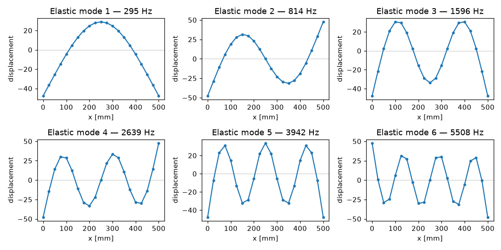
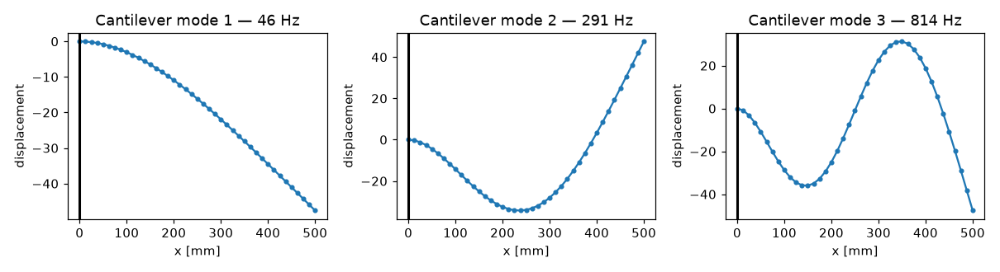

# Beam elements

This tutorial shows how to build a beam finite-element model with
`sd.model.Beam` and use it for modal analysis — computing natural frequencies
and mode shapes.

The `Beam` element is a **2-node line element** with **2 degrees of freedom per
node** (transverse displacement and rotation). Two formulations are available:

- **Euler–Bernoulli** (`mode="EB"`, the default) — thin-beam theory, neglects
  shear deformation.
- **Timoshenko** (`mode="T"`) — includes shear deformation and rotary inertia,
  more accurate for short/thick beams.

Assembling a model gives you the global mass matrix `M` and stiffness matrix
`K`, from which `solve()` returns the natural frequencies and mode shapes by
solving the generalized eigenproblem

$$
\mathbf{K}\,\boldsymbol{\phi}_i = \omega_i^2\,\mathbf{M}\,\boldsymbol{\phi}_i .
$$

## Defining the beam

A beam is described element by element. The relevant inputs are:

| Argument | Meaning |
|---|---|
| `length` | array of element lengths, one per element |
| `width`, `height` | rectangular cross-section dimensions |
| `density` | array of element densities |
| `Young` | array of element Young's moduli |
| `n_nodes` | number of nodes (`n_elements + 1`) |
| `org`, `conec` | node coordinates and element connectivity |

If you pass `org=None, conec=None` together with `n_nodes`, the node coordinates
and connectivity are generated automatically for a straight beam — so you only
need to provide them when modelling a non-trivial topology.

```{note}
`sd.model.Beam` does not impose any boundary conditions, so the model is
**free–free**. A free–free beam has two **rigid-body modes** at ≈ 0 Hz; the
elastic (bending) modes follow above them.
```

The example below uses a consistent **mm / N** unit system, so frequencies come
out in Hz.

```python
import numpy as np
from sdypy.model import Beam

n_elements = 20
length  = np.full(n_elements, 500 / n_elements)   # element lengths [mm]
density = np.full(n_elements, 7850e-12)           # density [t/mm^3]
Young   = np.full(n_elements, 180e3)              # Young's modulus [N/mm^2]

beam = Beam(org=None, conec=None,
            length=length, width=30, height=15,   # rectangular cross-section [mm]
            density=density, Young=Young,
            n_nodes=n_elements + 1)
```

## Node coordinates and connectivity (`org` and `conec`)

Passing `org=None, conec=None` lets the constructor generate the node layout for
you. You can also supply them explicitly — for example to control the node
numbering or element ordering. The two arguments are:

- **`org`** — a 1-D array of node coordinates along the beam axis. The default
  is `np.linspace(0, length.sum(), n_nodes)`.
- **`conec`** — an `(n_elements, 2)` integer array giving the two node indices
  of each element. The default is the sequential chain
  `[[0, 1], [1, 2], ..., [n-1, n]]`.

Setting them by hand (here reproducing the default) looks like this — note that
`n_nodes` is still required:

```python
n_nodes = n_elements + 1
org   = np.linspace(0, length.sum(), n_nodes)
conec = np.array([[i, i + 1] for i in range(n_elements)])

beam = Beam(org=org, conec=conec,
            length=length, width=30, height=15,
            density=density, Young=Young,
            n_nodes=n_nodes)
```

```{warning}
`sd.model.Beam` models a **straight** beam only. The element matrices depend
solely on the per-element `length`, and there is **no coordinate transformation**
that would orient elements in a global frame. Consequently the `org` coordinates
do **not** enter the mass/stiffness assembly — changing them does not change the
result. Geometrically non-straight configurations (angled or curved beams, 2-D/
3-D frames) therefore cannot be represented with this element; modelling them
would require per-element rotation matrices that the class does not currently
provide. Use `conec` to control connectivity and node ordering of a 1-D chain,
not to introduce geometric curvature.
```

## Inspecting the system matrices

The constructor assembles the global mass and stiffness matrices. Each node
carries 2 DOFs, so for `n_nodes` nodes the matrices are `2 * n_nodes` square:

```python
beam.M.shape   # -> (42, 42) for 21 nodes
beam.K.shape   # -> (42, 42)
```

The DOFs are interleaved per node as `[w_0, θ_0, w_1, θ_1, ...]`, where `w` is
the transverse displacement and `θ` the rotation. Transverse displacements are
therefore every other entry (`[::2]`).

## Solving for the modes

`solve()` returns the natural frequencies (in Hz, sorted ascending) and the
corresponding mode shapes. The number of modes is controlled by `n`:

```python
nat_freq, modes = beam.solve(n=10)
print(np.round(nat_freq[:6], 1))
# [   0.    0.  295.3  814.1 1596.1 2638.6]
```

As noted above, the first two frequencies are the rigid-body modes (≈ 0 Hz); the
first elastic bending mode is at ≈ 295 Hz.

```{note}
A `RuntimeWarning: invalid value encountered in sqrt` may appear because the
rigid-body modes have (numerically) tiny negative eigenvalues. Their frequencies
are set to 0 and the warning is harmless.
```

## Plotting mode shapes

`modes[:, k]` is the `k`-th mode shape over all DOFs; take `modes[::2, k]` for
the transverse displacements and plot them against the node coordinates
`beam.org`:

```python
import matplotlib.pyplot as plt

x = beam.org   # node positions [mm]

fig, axs = plt.subplots(2, 3, figsize=(10, 5))
for i, ax in enumerate(axs.flat):
    k = i + 2                             # skip the two rigid-body modes
    ax.plot(x, modes[::2, k], '-o', ms=3)
    ax.set_title(f"Elastic mode {i + 1} — {nat_freq[k]:.0f} Hz")
    ax.set_xlabel("x [mm]")
    ax.set_ylabel("displacement")
fig.tight_layout()
plt.show()
```



## Applying boundary conditions

`sd.model.Beam` has no built-in support for boundary conditions — `beam.solve()`
operates on the full, unconstrained matrices, which is why the examples above are
free–free. To impose supports, apply the constraints yourself by **removing the
fixed degrees of freedom** from `K` and `M` and solving the reduced eigenproblem.

Recall the DOF ordering: node `i` owns the transverse displacement `w` at DOF
`2 * i` and the rotation `θ` at DOF `2 * i + 1`. A few common supports:

| Support | DOFs to fix at the node |
|---|---|
| Clamped (encastre) | `2*i` and `2*i + 1` (displacement and rotation) |
| Pinned / simply supported | `2*i` only (displacement) |
| Free | none |

The example below clamps the left end to model a **cantilever**:

```python
import numpy as np
from scipy.linalg import eigh

K = np.asarray(beam.K)
M = np.asarray(beam.M)
ndof = beam.n_dof

# Clamp node 0: fix its displacement (DOF 0) and rotation (DOF 1)
fixed = [0, 1]
free = np.setdiff1d(np.arange(ndof), fixed)

# Solve the reduced eigenproblem
w, V = eigh(K[np.ix_(free, free)], M[np.ix_(free, free)])
order = np.argsort(w)
freq = np.sqrt(np.abs(w[order])) / (2 * np.pi)
print(np.round(freq[:3], 1))
# [ 46.4 290.9 814.4]   <- matches the analytical cantilever frequencies
```

With one end clamped there are no rigid-body modes, so the first frequency is
already the first bending mode (≈ 46 Hz). To plot a reduced mode shape, scatter
its entries back into a full DOF vector (the fixed DOFs are zero):

```python
import matplotlib.pyplot as plt

V = V[:, order]
mode = 0
full = np.zeros(ndof)
full[free] = V[:, mode]              # re-insert the fixed DOFs as zeros
plt.plot(beam.org, full[::2], '-o', ms=3)
plt.axvline(0, color='k', lw=2)      # clamped end
plt.title(f"Cantilever mode 1 — {freq[mode]:.0f} Hz")
plt.xlabel("x [mm]")
plt.ylabel("displacement")
plt.show()
```



## Timoshenko theory

To include shear deformation, build the beam with `mode="T"`:

```python
beam_t = Beam(org=None, conec=None,
              length=length, width=30, height=15,
              density=density, Young=Young,
              n_nodes=n_elements + 1,
              mode="T")
nat_freq_t, _ = beam_t.solve()
```

The Timoshenko frequencies are slightly lower than the Euler–Bernoulli ones
(the shear flexibility makes the beam less stiff), and the difference grows for
higher modes.

## Adding point masses

Concentrated masses can be attached at chosen nodes through `added_masses` and
`mass_locations` (node indices):

```python
beam_m = Beam(org=None, conec=None,
              length=length, width=30, height=15,
              density=density, Young=Young,
              n_nodes=n_elements + 1,
              added_masses=[0.5],          # added mass [t]
              mass_locations=[10])         # at node 10 (the mid-span)
nat_freq_m, _ = beam_m.solve()
```

The added mass lowers the frequencies of the modes that have significant motion
at that node.

## Non-uniform beams

Because `length`, `density` and `Young` are per-element arrays, stepped or
graded beams are described simply by varying those arrays element by element —
for example a beam whose second half is stiffer:

```python
Young = np.full(n_elements, 180e3)
Young[n_elements // 2:] *= 2             # stiffer second half
```

## Full example

A complete, runnable script — including the mode-shape plot — is available in
the package at
[`examples/beam_example.py`](https://github.com/sdypy/sdypy-model/blob/master/examples/beam_example.py).
