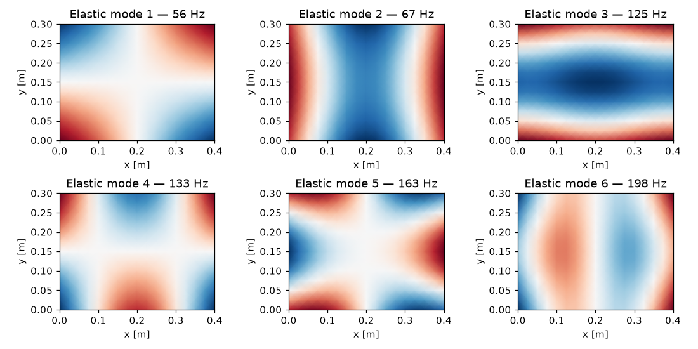

# Shell elements

This tutorial shows how to build a shell finite-element model with
`sd.model.Shell` and use it for modal analysis.

The `Shell` element is a **4-node quadrilateral MITC4 element** (Mixed
Interpolation of Tensorial Components), which avoids shear locking for thin
shells. Each node has **6 degrees of freedom** — three translations
(`ux, uy, uz`) and three rotations (`rx, ry, rz`).

Unlike `sd.model.Beam`, the `Shell` class only **assembles** the global mass
matrix `M` and stiffness matrix `K`; it has no built-in eigensolver, so the
modal problem is solved with SciPy's `eigsh`.

## Defining the mesh

A shell model needs a mesh given as two arrays:

- `nodes` — an `(n_nodes, 3)` array of nodal coordinates.
- `elements` — an `(n_elements, 4)` array of node indices, four per
  quadrilateral (ordered consistently around each element).

The example below builds a flat rectangular plate directly with NumPy, so the
tutorial is self-contained. SI units (metres) are used throughout.

```python
import numpy as np
from sdypy.model import Shell

# Flat rectangular plate, meshed with quadrilaterals
Lx, Ly = 0.4, 0.3                 # plate dimensions [m]
nx, ny = 16, 12                   # elements per direction

xs = np.linspace(0, Lx, nx + 1)
ys = np.linspace(0, Ly, ny + 1)
X, Y = np.meshgrid(xs, ys, indexing="ij")
nodes = np.column_stack([X.ravel(), Y.ravel(), np.zeros(X.size)])

def nid(i, j):
    return i * (ny + 1) + j

elements = np.array([[nid(i, j), nid(i + 1, j), nid(i + 1, j + 1), nid(i, j + 1)]
                     for i in range(nx) for j in range(ny)])
```

```{tip}
Real geometries are usually imported from a mesh file rather than built by hand
— see [Loading a mesh from a file](#loading-a-mesh-from-a-file) below.
```

## Building the model

Provide the material properties and thickness. Each of `E`, `nu`, `rho` and
`thickness` may be a single value (applied to every element) or an iterable with
one value per element:

```python
E   = 2.1e11     # Young's modulus [Pa]
nu  = 0.3        # Poisson's ratio
rho = 7850.0     # density [kg/m^3]
th  = 0.002      # thickness [m]

shell = Shell(nodes, elements, E, nu, rho, th, force_nonsingularity=True)
```

```{note}
`force_nonsingularity=True` adds a tiny value to the diagonal of the mass matrix
so it stays non-singular (the drilling rotation has no mass). This is
recommended before solving the eigenproblem. Set `verbose=1` to show an assembly
progress bar.
```

## Inspecting the system matrices

The constructor assembles the global matrices as SciPy sparse arrays. With 6
DOFs per node they are `6 * n_nodes` square:

```python
shell.K.shape   # -> (1326, 1326) for 221 nodes
shell.M.shape   # -> (1326, 1326)
```

The DOFs are ordered per node as `[ux, uy, uz, rx, ry, rz]`, so for node `i`
the out-of-plane displacement `uz` is DOF `6 * i + 2`.

## Solving for the modes

Solve the generalized eigenproblem `K φ = ω² M φ` with `scipy.sparse.linalg.eigsh`.
Using `sigma=0` (shift-invert) returns the lowest-frequency modes:

```python
import numpy as np
from scipy.sparse.linalg import eigsh

vals, vecs = eigsh(shell.K, M=shell.M, k=12, sigma=0, which="LM")

order = np.argsort(vals)
vals, vecs = vals[order], vecs[:, order]
freq = np.sqrt(np.abs(vals)) / (2 * np.pi)   # natural frequencies [Hz]
print(np.round(freq[:8], 1))
# [ 0.   0.   0.   0.   0.   0.  55.9 66.8]
```

The plate is unconstrained (free–free), so the first **six** modes are
rigid-body modes (≈ 0 Hz); the elastic modes follow, here the first at ≈ 56 Hz.

## Plotting mode shapes

For this flat plate the mode shapes are dominated by the out-of-plane
displacement `uz = vecs[2::6, k]`. Because the nodes lie on a structured grid,
`uz` can be reshaped and drawn as a contour map:

```python
import matplotlib.pyplot as plt

fig, axs = plt.subplots(2, 3, figsize=(10, 5))
for i, ax in enumerate(axs.flat):
    k = i + 6                                  # skip the 6 rigid-body modes
    uz = vecs[2::6, k].reshape(nx + 1, ny + 1)
    ax.pcolormesh(X, Y, uz, cmap="RdBu_r", shading="gouraud")
    ax.set_title(f"Elastic mode {i + 1} — {freq[k]:.0f} Hz")
    ax.set_aspect("equal")
    ax.set_xlabel("x [m]")
    ax.set_ylabel("y [m]")
fig.tight_layout()
plt.show()
```



## Assembly options

The `Shell` constructor exposes a few switches that affect the assembled
matrices:

- **`mass_lumping=True`** — lump the mass matrix to a diagonal form (faster
  eigensolves, slightly less accurate).
- **`force_nonsingularity=True`** — regularize the mass-matrix diagonal so the
  eigenproblem is well posed (recommended; see the note above).
- **`mass_threshold=<float>`** — zero out mass-matrix entries below the given
  magnitude to sparsify it.
- **Per-element materials** — pass arrays of length `n_elements` for `E`, `nu`,
  `rho`, or `thickness` to model spatially varying properties.

(loading-a-mesh-from-a-file)=
## Loading a mesh from a file

For real geometries, read the mesh with [`meshio`](https://github.com/nschloe/meshio)
and extract the quadrilateral cells. The shipped example uses an L-bracket mesh:

```python
import meshio
import numpy as np

mesh = meshio.read("examples/data/L_bracket.msh")
nodes = mesh.points / 1000          # convert mm -> m

elements = np.vstack([cells.data for cells in mesh.cells if cells.type == "quad"])

shell = Shell(nodes, elements, E=2.069e11, nu=0.3, rho=7829,
              thickness=0.001, force_nonsingularity=True)
```

## Full example

A complete, runnable script — including a 3-D PyVista visualization of the mode
shapes — is available in the package at
[`examples/shell_example.py`](https://github.com/sdypy/sdypy-model/blob/master/examples/shell_example.py).
