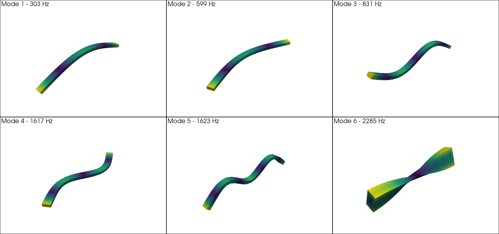

# Tetrahedron elements

This tutorial shows how to build a solid finite-element model with
`sd.model.Tetrahedron` and use it for modal analysis.

The `Tetrahedron` element is a **10-node quadratic tetrahedron** (`tetra10`) —
four corner nodes plus one mid-side node on each of the six edges. It is a
**solid** element with **3 translational degrees of freedom per node**
(`ux, uy, uz`); it has no rotational DOFs. The quadratic shape functions make it
well suited to meshing curved geometries and bending-dominated solids.

Like `sd.model.Beam` (and unlike `sd.model.Shell`), the class has a **built-in
eigensolver** `solve()`, so once the mesh and material are set you get the
natural frequencies and mode shapes directly. It also supports **boundary
conditions** natively through a DOF mask, and **point masses**.

Assembling a model gives the global mass matrix `M` and stiffness matrix `K`
(SciPy sparse), from which `solve()` returns the natural frequencies and mode
shapes of the generalized eigenproblem

$$
\mathbf{K}\,\boldsymbol{\phi}_i = \omega_i^2\,\mathbf{M}\,\boldsymbol{\phi}_i .
$$

## Defining the mesh

A solid model needs a volume mesh of 10-node tetrahedra, given as two arrays:

- `org` — an `(n_nodes, 3)` array of nodal coordinates.
- `conec` — an `(n_elements, 10)` integer array of node indices, ten per
  tetrahedron (four corners followed by the six edge mid-nodes, in the standard
  `tetra10` ordering).

Such meshes are normally produced by a mesher (Gmsh, etc.) and read with
[`meshio`](https://github.com/nschloe/meshio); the quadratic tets are in
`cells_dict["tetra10"]`. The shipped example uses a meshed beam
(500 × 30 × 15 mm):

```python
import numpy as np
import meshio
from sdypy.model import Tetrahedron

mesh  = meshio.read("examples/data/Beam - simple.msh")
org   = mesh.points                    # (n_nodes, 3) coordinates [mm]
conec = mesh.cells_dict["tetra10"]     # (n_elements, 10) connectivity

org.shape      # -> (1905, 3)
conec.shape    # -> (1008, 10)
```

```{note}
This mesh and the material below use a consistent **mm / N / t** unit system
(lengths in mm, density in t/mm³, modulus in N/mm²), so the natural frequencies
come out in Hz — the same convention as the {doc}`beam tutorial <beam>`.
```

## Building the model

Pass the geometry together with the material properties. `Young` and `Density`
may be a single value (applied to every element) or an array with one value per
element; `Poisson` is a single value:

```python
Young   = 190000.0     # Young's modulus [N/mm^2]
Density = 7850e-12     # density [t/mm^3]
Poisson = 0.3

tet = Tetrahedron(org, conec, Young, Density, Poisson, calc_n_freq=20)
```

`calc_n_freq` sets how many modes `solve()` will later compute. The remaining
constructor arguments (`dof_mask`, `added_masses`, `mass_locations`, `lumped`)
are covered in the sections below.

## Inspecting the system matrices

The constructor assembles the global matrices as SciPy sparse arrays. With 3
DOFs per node they are `3 * n_nodes` square:

```python
tet.K.shape    # -> (5715, 5715) for 1905 nodes
tet.M.shape    # -> (5715, 5715)
tet.n_dof      # -> 5715
```

The DOFs are ordered per node as `[ux, uy, uz]`, so node `i` owns DOFs
`3*i`, `3*i + 1`, `3*i + 2`.

## Solving for the modes

`solve()` computes `calc_n_freq` modes with shift-invert (`eigsh`, `sigma=0`) and
stores the results on the object:

```python
tet.solve()

print(np.round(tet.nat_freq[:10], 1))
# [   0.    0.    0.    0.    0.    0.  302.7  599.4  831.5 1616.5]
```

After solving, the following attributes are available:

| Attribute | Meaning |
|---|---|
| `tet.nat_freq` | natural frequencies [Hz], ascending |
| `tet.eigval` | eigenvalues `ω²` |
| `tet.eigvec` | mode shapes, one per column, over the (free) DOFs |
| `tet.eigvec_full` | mode shapes mapped back onto **all** DOFs (see boundary conditions) |
| `tet.A` | mode shapes reshaped to `(n_modes, n_nodes, 3)` — handy for plotting |

The solid is unconstrained (free–free), so the first **six** modes are
rigid-body modes (≈ 0 Hz); the elastic modes follow, here the first bending mode
at ≈ 303 Hz — close to the equivalent {doc}`beam model <beam>` (≈ 295 Hz).

```{note}
A `RuntimeWarning: invalid value encountered in sqrt` may appear because the
rigid-body modes have (numerically) tiny negative eigenvalues. Their frequencies
are set to 0 and the warning is harmless.
```

## Plotting mode shapes

`tet.A[k]` is the `k`-th mode shape as an `(n_nodes, 3)` displacement field. The
example renders the deformed surface with [PyVista](https://pyvista.org) by
adding the displacement (scaled for visibility) to the node coordinates and
colouring by displacement magnitude:

```python
import pyvista as pv

# Triangular surface facets (corner nodes) of each tetrahedron, for display
inds = np.array([[2, 1, 0], [1, 3, 0], [3, 2, 0], [2, 3, 1]])
tris = np.unique(np.vstack([el[i] for el in conec for i in inds]), axis=0)
faces = np.hstack([np.hstack(([3], t)) for t in tris]).astype(np.int64)

k = 6                                            # first elastic mode
shape = tet.A[k]                                 # (n_nodes, 3) displacement
scale = np.linalg.norm(org) / np.linalg.norm(shape) / 12
mesh = pv.PolyData(org + scale * shape, faces)
mesh["disp"] = np.linalg.norm(shape, axis=1)

pl = pv.Plotter()
pl.add_mesh(mesh, scalars="disp", cmap="viridis")
pl.show()
```



The first five elastic modes are bending modes (in the two cross-sectional
planes), and the sixth (≈ 2285 Hz) is the first torsional mode — motion that a
1-D beam element cannot represent but a solid element captures naturally.

```{tip}
On a headless machine (e.g. WSL without a display), render off-screen instead:
`pv.Plotter(off_screen=True)` followed by `pl.screenshot("modes.png")`.
```

## Applying boundary conditions

Unlike `Beam` and `Shell`, the `Tetrahedron` constructor supports constraints
directly through the **`dof_mask`** argument: a boolean array over all
`3 * n_nodes` DOFs that is `True` for free DOFs and `False` for fixed ones. The
matrices are reduced to the free DOFs before solving, and `solve()` scatters the
mode shapes back onto the full DOF set (`tet.eigvec_full`, `tet.A`) with zeros at
the constrained DOFs — so plotting works unchanged.

The example below clamps every node on the `x = 0` face to model a
**cantilever**:

```python
# Fix all three DOFs of every node on the x = 0 face
fixed_nodes = np.where(np.isclose(org[:, 0], 0.0))[0]

dof_mask = np.ones(org.shape[0] * 3, dtype=bool)
for n in fixed_nodes:
    dof_mask[3 * n : 3 * n + 3] = False          # clamp ux, uy, uz

tet_c = Tetrahedron(org, conec, Young, Density, Poisson,
                    calc_n_freq=10, dof_mask=dof_mask)
tet_c.solve()
print(np.round(tet_c.nat_freq[:4], 1))
# [ 47.9  95.4 299.3 588.6]
```

With one face clamped there are no rigid-body modes, so the first frequency is
already the first bending mode (≈ 48 Hz, in good agreement with the analytical
cantilever beam). To plot, use `tet_c.A[k]` exactly as above — it is already
defined over all nodes, with the clamped face at zero displacement.

## Adding point masses

Concentrated masses can be attached at chosen nodes through `added_masses` and
`mass_locations` (node indices). The mass is added to the three translational
DOFs of each listed node:

```python
tet_m = Tetrahedron(org, conec, Young, Density, Poisson, calc_n_freq=10,
                    added_masses=[1e-3],         # added mass [t]
                    mass_locations=[0])          # at node 0
tet_m.solve()
```

The added mass lowers the frequencies of the modes that have significant motion
at that node.

## Lumped mass matrix

By default the consistent mass matrix is assembled. Passing `lumped=True` builds
a diagonal (lumped) mass matrix instead, which makes the eigensolve cheaper at a
small accuracy cost:

```python
tet_l = Tetrahedron(org, conec, Young, Density, Poisson,
                    calc_n_freq=10, lumped=True)
tet_l.solve()
print(np.round(tet_l.nat_freq[6:10], 1))
# [301.9 597.6 827.6 1608.4]   <- slightly below the consistent-mass result
```

## Full example

A complete, runnable script — including the 3-D PyVista visualization of the
mode shapes — is available in the package at
[`examples/tetrahedron_example.py`](https://github.com/sdypy/sdypy-model/blob/master/examples/tetrahedron_example.py).
